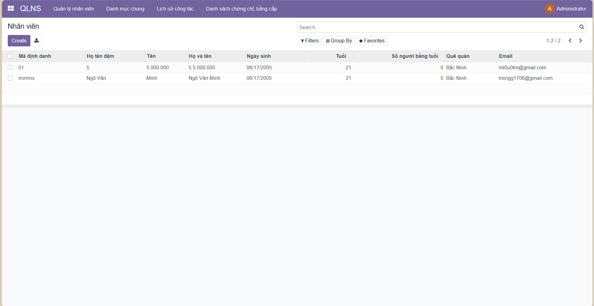
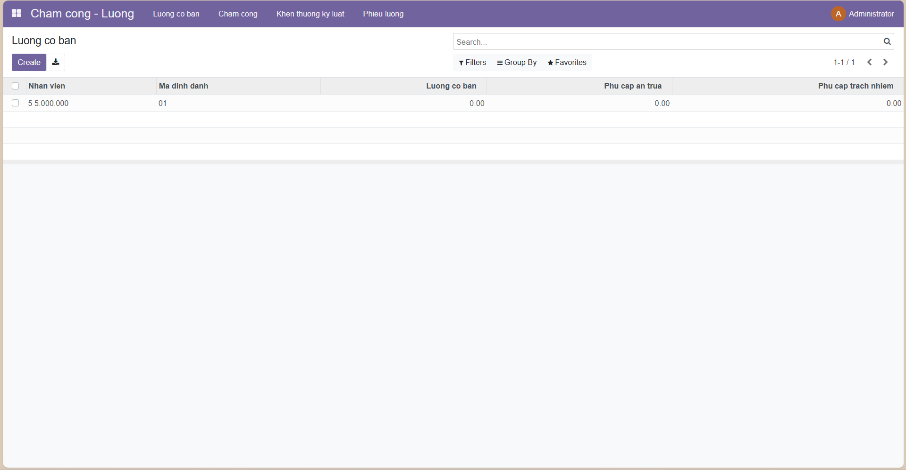
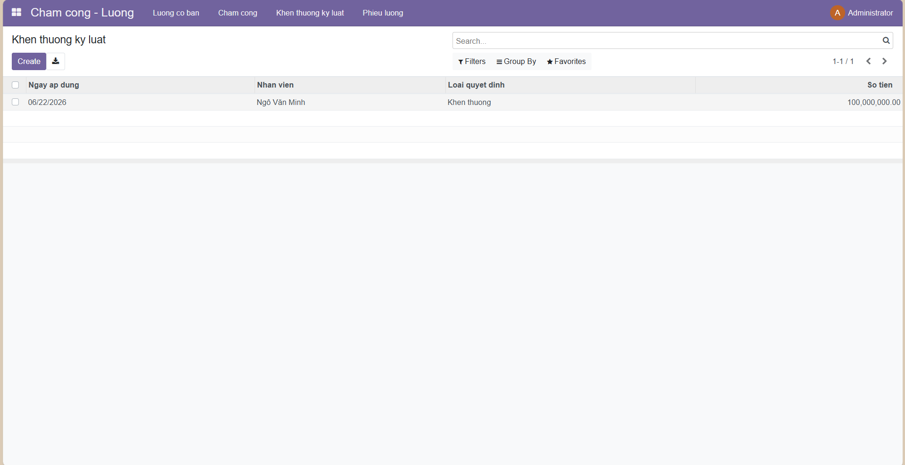
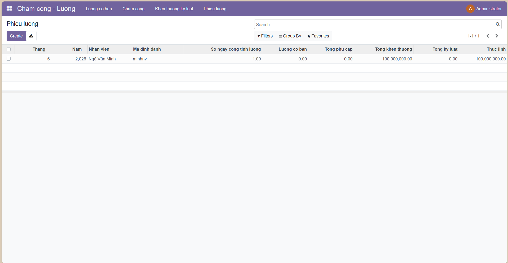

# Bài tập Lab: Quản lý chấm công và lương

Đây là bài lab Odoo xây dựng module `quan_ly_cham_cong_luong` để quản lý chấm công, khen thưởng/kỷ luật và tính phiếu lương tháng. Dữ liệu nhân viên được kế thừa từ module `nhan_su` đã làm ở bài trước.

## Mục tiêu

- Quản lý dữ liệu lương cơ bản theo nhân viên
- Ghi nhận chấm công theo ngày
- Ghi nhận khen thưởng và kỷ luật trong tháng
- Tự động tính phiếu lương tháng từ các dữ liệu đầu vào

## Cấu trúc chính

- `quan_ly_cham_cong_luong/models/`
  - `hr_luong_co_ban.py`
  - `hr_cham_cong.py`
  - `hr_khen_thuong_ky_luat.py`
  - `hr_phieu_luong.py`
- `quan_ly_cham_cong_luong/views/`
  - các file XML cho menu, form, tree và action
- `quan_ly_cham_cong_luong/security/ir.model.access.csv`
  - cấu hình quyền truy cập model
- `img/`
  - ảnh minh họa giao diện và kết quả kiểm thử

## Cài đặt và chạy

1. Chép thư mục `quan_ly_cham_cong_luong` vào `addons_path` của Odoo, hoặc thêm toàn bộ thư mục `BaiTapLab` vào `addons_path`.
2. Bảo đảm module `nhan_su` đã tồn tại và đã được cài đặt.
3. Khởi động Odoo, cập nhật danh sách ứng dụng, rồi cài module `Quan ly cham cong va luong`.
4. Tạo dữ liệu mẫu cho nhân viên, lương cơ bản, chấm công, khen thưởng/kỷ luật.
5. Mở `Phieu luong` để kiểm tra công thức tính tự động.

## Công thức tính lương

```text
Thực lĩnh = (Lương cơ bản / 26) * Số ngày công + Phụ cấp + Khen thưởng - Kỷ luật
```

## Gợi ý sử dụng

- Nhập dữ liệu nhân viên trước
- Thiết lập lương cơ bản theo từng nhân viên
- Cập nhật chấm công theo tháng
- Ghi nhận các quyết định khen thưởng hoặc kỷ luật phát sinh trong tháng
- Sinh phiếu lương để kiểm tra kết quả

## Ảnh minh họa










## Ghi chú

Repository này được chuẩn bị để nộp bài lab và có thể tiếp tục phát triển thêm nếu cần mở rộng chức năng hoặc tích hợp các phần nâng cao khác.
