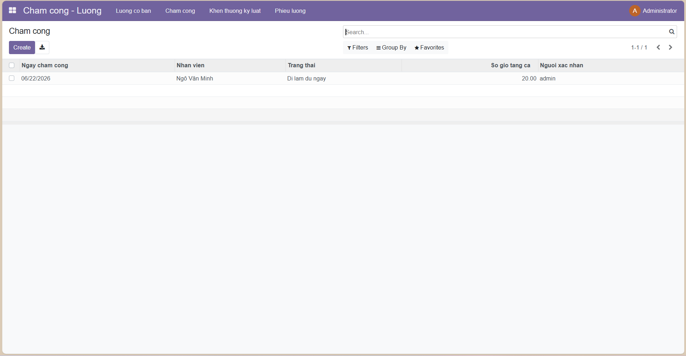

# Bai tap lab: Quan ly cham cong va luong

Module Odoo `quan_ly_cham_cong_luong` cho bai tap lab. Module nay dung du lieu nhan vien tu module `nhan_su` o bai toan truoc do.

## Chuc nang

- Cau hinh luong co ban theo nhan vien
- Cham cong theo ngay
- Khen thuong va ky luat
- Phieu luong thang tu dong tinh

## Cai dat

1. Copy thu muc `quan_ly_cham_cong_luong` vao duong dan addons cua Odoo, hoac them `BaiTapLab` vao `addons_path`.
2. Dam bao module `nhan_su` da co san va duoc cai dat.
3. Cap nhat danh sach module va cai dat `quan_ly_cham_cong_luong`.

## Cac buoc tiep theo

1. Mo Odoo va dang nhap tai khoan quan tri.
2. Vao `Apps`, chon `Update Apps List` neu chua thay module.
3. Tim `Quan ly cham cong va luong` va bam `Install`.
4. Tao du lieu mau cho `Luong co ban`, `Cham cong`, `Khen thuong/Ky luat`.
5. Mo `Phieu luong` de kiem tra cong thuc tinh luong tu dong.
6. Chup man hinh ket qua va them vao bao cao/slide nop bai.

## Cong thuc tinh luong

`Thuc linh = (Luong co ban / 26) * So ngay cong + Phu cap + Khen thuong - Ky luat`

## Anh minh hoa

